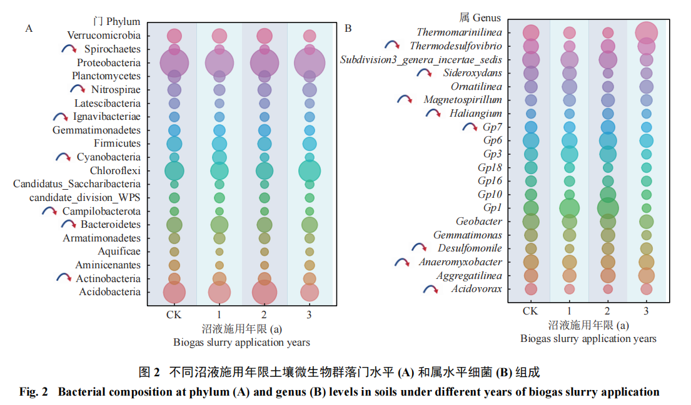
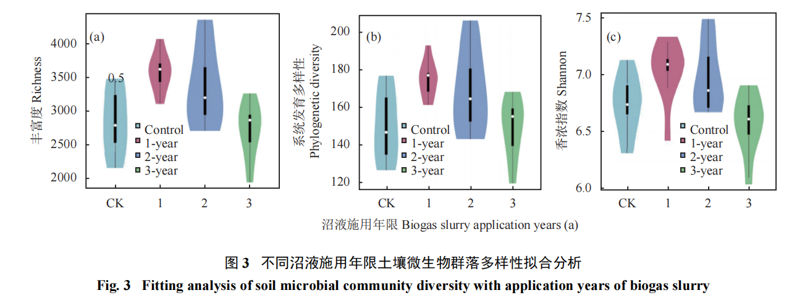

很多老乡和农技员都在问：**不用化肥，全靠猪粪发酵的沼液，水稻能长好吗？土壤会不会越种越坏？**

为了验证这个问题，科研团队在浙江湖州长兴进行了长达 **3年** 的真实田间试验。用详实的数据告诉你：沼液不仅能当化肥，而且效果更好！

## 核心试验数据：真金不怕火炼

口说无凭，我们直接看连续3年记录的真实对比数据。

### 1. 产量与大米品质对比

老乡最关心的是"打多少粮"和"好不好吃"。

| 施肥方式 | 水稻产量 (kg/hm²) | 折合亩产 | 蛋白质含量 (g/kg) |
| :--- | :---: | :---: | :---: |
| **全用化肥 (对照组)** | 7800 | 约 520 公斤/亩 | 58.67 |
| **施用沼液 1年** | 9669 | 约 644 公斤/亩 | 71.00 |
| **施用沼液 2年** | 9765 | 约 651 公斤/亩 | 73.11 |
| **施用沼液 3年** | **9823** | **约 655 公斤/亩** | **73.31** |

> 💡 **结论总结：** 连续施用3年沼液，比全用化肥增产显著，大米蛋白质含量大幅提升，且口感完全不受影响！

### 2. 土壤肥力与微生物变化（越种越肥）

长期用化肥容易导致土壤板结，那么沼液呢？

| 施肥方式 | 有机质 (g/kg) | 速效钾 (mg/kg) | 结论 |
| :--- | :---: | :---: | :--- |
| **全用化肥 (对照)** | 13.83 | 96.55 | 土壤养分一般 |
| **施用沼液 3年** | **22.01** | **276.91** | **有机质提升近60%，速效钾翻两倍多！** |

专家还对土壤里的微生物进行了 DNA 测序。结果显示，连用3年后，土壤里的优势有益菌群（如变形菌门，能帮植物吸收养分）比例显著增加！

## 一线实战指导：到底该怎么泼？

想要达到专家的增产效果，绝不是随便乱泼的，建议农技人员指导老乡严格参考以下方案：

### 田间操作要点

- **🎯 把准时机**：水稻生长期最关键。试验中每年施用 **2次**。
    - **6月**（插秧 / 分蘖期）：打好底子。
    - **9月**（抽穗 / 灌浆期）：补充营养。
- **⚖️ 控制用量**：单次施用量约为每亩 **20吨**。
    - *说明：沼液绝大部分是水。这20吨里含有的总氮量，刚好和常规化肥的投入量相当（氮投入量约 122.2 kg/hm²），不用担心烧苗。*

## 常见"疑难杂症"解答

<strong>🔴 痛点一：地会不会越泼越酸？</strong>

<strong>专家答：别慌，这是正常过渡期！</strong>

测定数据显示，<strong>第一年</strong>土壤酸碱度(pH)不变（5.74）；<strong>第二年</strong>确实会微降变酸（5.57）；<strong>但是到了第三年</strong>，土壤的自我调节机制启动，pH值完全恢复正常（5.83）。只要坚持科学施用，沼液不会导致土壤酸化，反而会让土壤维持高水平有机质，越来越松软。

<strong>🔴 痛点二：会不会光长叶子不结穗（贪青晚熟）？</strong>

<strong>专家答：严格控量就不会！</strong>

沼液里的"铵态氮"含量极高（占全氮92.99%），属于速效养分，水稻吸收极快。只要严格按照<strong>单次亩用20吨</strong>的标准，它的纯氮投入量和化肥对照田是一模一样的。不仅不会贪青，反而能促进谷粒饱满，蛋白质和钾含量显著提高。

<strong>🔴 痛点三：重金属会不会超标，大米还能吃吗？</strong>

<strong>专家答：源头把控是关键！</strong>

本次试验提取的沼液，铅(0.03mg/L)、镉(0.002mg/L)、铬(0.50mg/L)等均远远低于国家安全标准，没有检测到砷和汞。在实际推广中，一定要叮嘱老乡：务必使用<strong>规范化养猪场</strong>（不乱用重金属添加剂）且经过充分厌氧发酵的沼液，安全完全有保障。

<strong>🔴 痛点四：病菌会不会太多导致水稻生病？</strong>

<strong>专家答：有实测数据铁证，土壤能自我恢复！</strong>

猪粪经过沼气池的充分"厌氧发酵"后，绝大多数病原菌已经被杀死。虽然施入田里初期会打破原来的生态，但土壤的自我修复能力极强！

施用沼液第3年时，土壤微生物的多样性（香浓指数等）已经完全恢复到了和没施沼液前一样健康、稳定的水平！长期用不仅不生病，反而能提高土壤微生态环境的稳定性。

